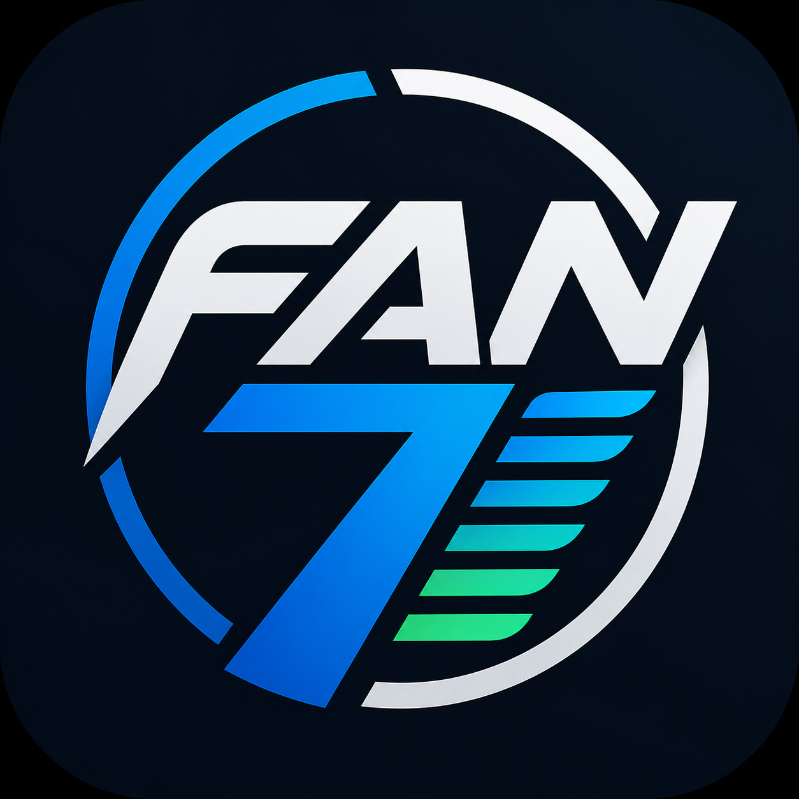
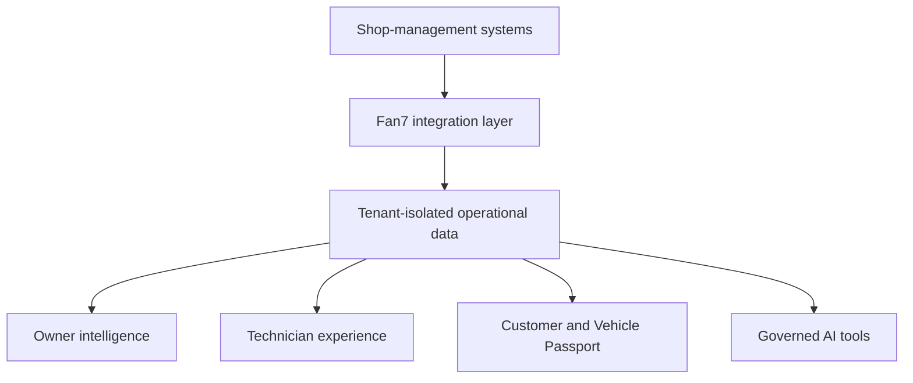
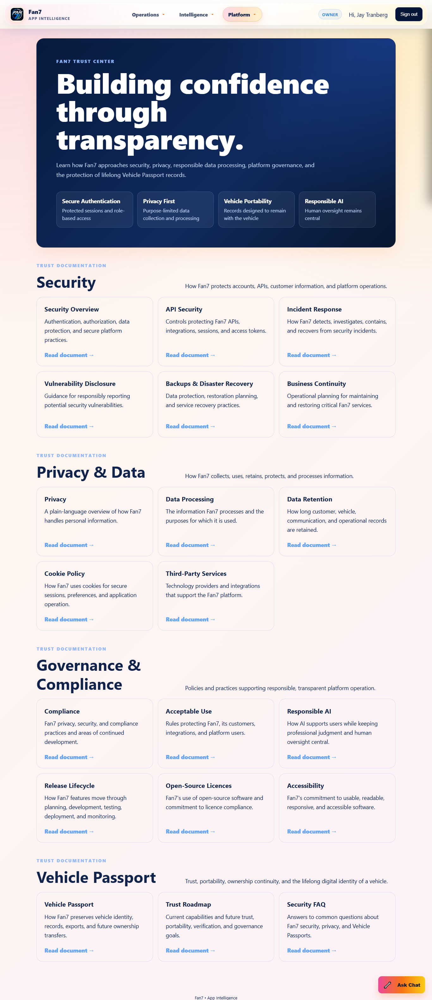

Fan7 — The Technician

  <strong>AI-native customer experience and operational intelligence for automotive service businesses.</strong>

  
  
  
  

  
  
  
  
  
  

Your shop management software manages repairs. Fan7 manages the customer experience.

  

Platform Overview

Fan7 is a multi-tenant SaaS platform designed to connect automotive service businesses, technicians, advisors, vehicles, and customers within one secure engagement ecosystem.

The platform complements established shop-management systems instead of replacing them. Fan7 transforms operational data into customer experiences, technician intelligence, Vehicle Passport records, performance insights, and carefully governed AI capabilities.

Fan7 is being shaped inside a real automotive-service environment. Bullfrog Transmission serves as the initial operational validation setting, where proven shop practices are informing the platform's workflows and product direction.

Engineering Snapshot

Area

Current capability

Platform

Production multi-tenant SaaS architecture

Data

26,185+ synchronized customer records

Integrations

Per-tenant Shopmonkey connectivity

Synchronization

Customers, repair orders, and service items

Customer experience

Customer portal and Vehicle Passport

Technician experience

Performance intelligence and dashboard capabilities

Security

JWT authentication, role-based access, and tenant isolation

AI foundation

Secure, read-only Model Context Protocol tooling

The Opportunity

Automotive service businesses already generate valuable operational data, but that information is often fragmented across repair orders, customer records, technician activity, and vehicle histories.

Fan7 brings those signals together to support three connected experiences:

Owners and managers gain clearer operational and performance intelligence.

Technicians and advisors receive recognition, coaching signals, and actionable context.

Customers gain a more transparent relationship with their shop and vehicle history.

Platform Capabilities

Customer Experience

Customer portal

Profile claiming

Vehicle history and service timeline

Vehicle Passport

Digital communication

Customer engagement workflows

Technician Experience

Technician dashboard

XP and level system

Performance analytics

Leaderboards

Coaching insights

Recognition system

Shop Intelligence

Repair-order analytics

Parts and labor metrics

Technician productivity

Operational dashboards

Store performance metrics

Multi-shop support

Integration management

AI Integration

Fan7 provides a secure foundation for enterprise AI assistants through the Model Context Protocol (MCP).

Current safeguards include:

Bearer-token authentication

Read-only tools

Tenant-aware responses

Structured response contracts

Safe response filtering

Versioned tool architecture

Human oversight for consequential decisions

Multi-Tenant Architecture

Each participating repair shop manages an isolated operating context, including its integration credentials, shop identifiers, customer records, repair orders, service items, synchronization checkpoints, and integration status.

This design allows Fan7 to onboard additional shops without requiring a separate application deployment for every tenant.

flowchart TD
    A[Shop-management systems] --> B[Fan7 integration layer]
    B --> C[Tenant-isolated operational data]
    C --> D[Owner intelligence]
    C --> E[Technician experience]
    C --> F[Customer and Vehicle Passport]
    C --> G[Governed AI tools]

Trust, Security, and Governance

Fan7 includes a dedicated Trust Center describing how the platform approaches account security, privacy, responsible data processing, platform governance, business continuity, responsible AI, and lifelong Vehicle Passport records.

Core trust principles include:

Secure authentication: Protected sessions and role-based access

Privacy first: Purpose-limited collection and processing

Vehicle portability: Records designed to remain connected to the vehicle

Responsible AI: Professional judgment and human oversight remain central

Explore the Fan7 Trust Center

The public Trust Center describes Fan7's practices and direction. It does not claim third-party certification unless a certification is explicitly identified.

Product Gallery

Approved product screenshots will be added as the public demonstration set is prepared.

Experience

Public-showcase status

Owner dashboard

Screenshot placeholder

Technician dashboard

Screenshot placeholder

Customer portal

Screenshot placeholder

Vehicle Passport

Screenshot placeholder

Integration status

Optional sanitized screenshot

All public screenshots are reviewed to remove personal information, customer records, vehicle identifiers, credentials, internal IDs, and confidential financial data.

Current and Planned AI Capabilities

Capability

Status

Technician dashboard

Available

Customer summary

Planned

Leaderboards

Planned

Repair-order intelligence

Planned

Vehicle-history intelligence

Planned

Advisor dashboard

Planned

Store analytics

Planned

Marketing intelligence

Planned

Roadmap

Customer Platform

Customer and vehicle timelines

Loyalty platform

Digital service history

Enhanced Vehicle Passport portability

Technician Platform

Achievements and recognition

AI-assisted coaching

Performance trends

Career progression

Management Platform

Store intelligence

Advisor dashboard

KPI analytics

Predictive reporting

AI Platform

Customer summaries

Repair-order intelligence

Vehicle-history intelligence

Store analytics

Marketing insights

Predictive intelligence

Public Repository Scope

This repository is the public product and engineering showcase for Fan7 — The Technician. It contains approved documentation, architecture summaries, screenshots, and roadmap information.

The production source code, customer data, integration credentials, internal endpoints, deployment configuration, and proprietary business logic are maintained separately and are not included here.

Documentation

About Fan7

Architecture

Features

Operational Pilot

Trust Center

Roadmap

Security Policy

Contribution Guidelines

Vision

Fan7 is evolving into an AI-native automotive engagement platform that enables secure collaboration between people, operational systems, and AI.

The goal is straightforward: give independent automotive service businesses enterprise-grade customer engagement, technician intelligence, and responsible AI-powered insight without disrupting the workflows that already run the shop.

Ownership and License

Fan7 — The Technician is designed and developed by Jay Tranberg / App Intelligence.ca.

Copyright © 2026 App Intelligence. All rights reserved.

This public repository is provided for product evaluation and informational purposes. Unauthorized copying, distribution, modification, republication, or commercial use is prohibited except where expressly permitted in writing. See LICENSE.md.
# Fan7 — The Technician

  <strong>AI-native customer experience and operational intelligence for automotive service businesses.</strong>

  
  
  
  

  
  
  
  
  
  

> **Your shop management software manages repairs. Fan7 manages the customer experience.**

> **Hero image placeholder:** Add the approved Fan7 hero image as `assets/fan7-hero.png`, then replace this block with ``.

---

## Platform Overview

**Fan7** is a multi-tenant SaaS platform designed to connect automotive service businesses, technicians, advisors, vehicles, and customers within one secure engagement ecosystem.

The platform complements established shop-management systems instead of replacing them. Fan7 transforms operational data into customer experiences, technician intelligence, Vehicle Passport records, performance insights, and carefully governed AI capabilities.

Fan7 is being shaped inside a real automotive-service environment. Bullfrog Transmission serves as the initial operational validation setting, where proven shop practices are informing the platform's workflows and product direction.

## Engineering Snapshot

| Area | Current capability |
| --- | --- |
| Platform | Production multi-tenant SaaS architecture |
| Data | 26,185+ synchronized customer records |
| Integrations | Per-tenant Shopmonkey connectivity |
| Synchronization | Customers, repair orders, and service items |
| Customer experience | Customer portal and Vehicle Passport |
| Technician experience | Performance intelligence and dashboard capabilities |
| Security | JWT authentication, role-based access, and tenant isolation |
| AI foundation | Secure, read-only Model Context Protocol tooling |

## The Opportunity

Automotive service businesses already generate valuable operational data, but that information is often fragmented across repair orders, customer records, technician activity, and vehicle histories.

Fan7 brings those signals together to support three connected experiences:

- **Owners and managers** gain clearer operational and performance intelligence.
- **Technicians and advisors** receive recognition, coaching signals, and actionable context.
- **Customers** gain a more transparent relationship with their shop and vehicle history.

## Platform Capabilities

### Customer Experience

- Customer portal
- Profile claiming
- Vehicle history and service timeline
- Vehicle Passport
- Digital communication
- Customer engagement workflows

### Technician Experience

- Technician dashboard
- XP and level system
- Performance analytics
- Leaderboards
- Coaching insights
- Recognition system

### Shop Intelligence

- Repair-order analytics
- Parts and labor metrics
- Technician productivity
- Operational dashboards
- Store performance metrics
- Multi-shop support
- Integration management

### AI Integration

Fan7 provides a secure foundation for enterprise AI assistants through the **Model Context Protocol (MCP)**.

Current safeguards include:

- Bearer-token authentication
- Read-only tools
- Tenant-aware responses
- Structured response contracts
- Safe response filtering
- Versioned tool architecture
- Human oversight for consequential decisions

## Multi-Tenant Architecture

Each participating repair shop manages an isolated operating context, including its integration credentials, shop identifiers, customer records, repair orders, service items, synchronization checkpoints, and integration status.

This design allows Fan7 to onboard additional shops without requiring a separate application deployment for every tenant.

## Trust, Security, and Governance

Fan7 includes a dedicated Trust Center describing how the platform approaches account security, privacy, responsible data processing, platform governance, business continuity, responsible AI, and lifelong Vehicle Passport records.

Core trust principles include:

- **Secure authentication:** Protected sessions and role-based access
- **Privacy first:** Purpose-limited collection and processing
- **Vehicle portability:** Records designed to remain connected to the vehicle
- **Responsible AI:** Professional judgment and human oversight remain central

[Explore the Fan7 Trust Center](https://fan7.netlify.app/trust)

> The public Trust Center describes Fan7's practices and direction. It does not claim third-party certification unless a certification is explicitly identified.

## Product Gallery

Approved product screenshots will be added as the public demonstration set is prepared.

| Experience | Public-showcase status |
| --- | --- |
| Owner dashboard | Screenshot placeholder |
| Technician dashboard | Screenshot placeholder |
| Customer portal | Screenshot placeholder |
| Vehicle Passport | Screenshot placeholder |
| Integration status | Optional sanitized screenshot |

All public screenshots are reviewed to remove personal information, customer records, vehicle identifiers, credentials, internal IDs, and confidential financial data.

## Current and Planned AI Capabilities

| Capability | Status |
| --- | :---: |
| Technician dashboard | Available |
| Customer summary | Planned |
| Leaderboards | Planned |
| Repair-order intelligence | Planned |
| Vehicle-history intelligence | Planned |
| Advisor dashboard | Planned |
| Store analytics | Planned |
| Marketing intelligence | Planned |

## Roadmap

### Customer Platform

- Customer and vehicle timelines
- Loyalty platform
- Digital service history
- Enhanced Vehicle Passport portability

### Technician Platform

- Achievements and recognition
- AI-assisted coaching
- Performance trends
- Career progression

### Management Platform

- Store intelligence
- Advisor dashboard
- KPI analytics
- Predictive reporting

### AI Platform

- Customer summaries
- Repair-order intelligence
- Vehicle-history intelligence
- Store analytics
- Marketing insights
- Predictive intelligence

## Public Repository Scope

This repository is the public product and engineering showcase for Fan7 — The Technician. It contains approved documentation, architecture summaries, screenshots, and roadmap information.

The production source code, customer data, integration credentials, internal endpoints, deployment configuration, and proprietary business logic are maintained separately and are not included here.

## Documentation

- [About Fan7](docs/ABOUT.md)
- [Architecture](docs/ARCHITECTURE.md)
- [Features](docs/FEATURES.md)
- [Operational Pilot](docs/PILOT.md)
- [Trust Center](docs/TRUST-CENTER.md)
- [Roadmap](docs/ROADMAP.md)
- [Security Policy](SECURITY.md)
- [Contribution Guidelines](CONTRIBUTING.md)

## Vision

Fan7 is evolving into an AI-native automotive engagement platform that enables secure collaboration between people, operational systems, and AI.

The goal is straightforward: **give independent automotive service businesses enterprise-grade customer engagement, technician intelligence, and responsible AI-powered insight without disrupting the workflows that already run the shop.**

## Ownership and License

Fan7 — The Technician is designed and developed by **Jay Tranberg / App Intelligence.ca**.

Copyright © 2026 App Intelligence.ca. All rights reserved.

This public repository is provided for product evaluation and informational purposes. Unauthorized copying, distribution, modification, republication, or commercial use is prohibited except where expressly permitted in writing. See [LICENSE.md](LICENSE.md).

---

  <strong>Fan7 · The Technician · App Intelligence.ca</strong> 
  Secure AI for the automotive service industry.

