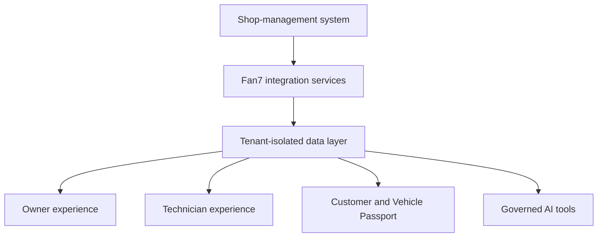

# Fan7 Architecture

This page provides a public, non-sensitive overview of the Fan7 platform architecture. It intentionally excludes source code, credentials, internal endpoints, deployment secrets, database connection details, and proprietary business logic.

## Architectural Goals

Fan7 is designed around five goals:

1. Keep each shop's operating context isolated.
2. Complement existing shop-management systems.
3. Present consistent experiences across owners, technicians, and customers.
4. Support carefully governed AI access.
5. Allow additional shops to onboard without separate application deployments.

## Platform Flow

## Application Layer

Fan7 uses a modern TypeScript application architecture built around Next.js and React. Protected application routes serve role-appropriate experiences for authorized users.

## Integration Layer

Per-tenant integrations synchronize approved operational records from supported shop-management platforms. Synchronization state and integration configuration remain scoped to the participating shop.

## Data Layer

MongoDB and Mongoose support normalized application records and tenant-aware access patterns. Public documentation describes the isolation model without exposing collection layouts or security-sensitive implementation details.

## Identity and Authorization

Fan7 uses authenticated sessions, JSON Web Tokens, role-based authorization, and protected routes. Authorization decisions consider both the user's role and operating context.

## AI Tooling

Fan7's Model Context Protocol foundation is designed around authenticated, tenant-aware, read-only tools with structured outputs and safe response filtering. Human judgment remains central to operational and customer decisions.

## Deployment

The production platform uses managed application and database services. Deployment configuration, environment variables, internal monitoring, and recovery procedures remain private.
